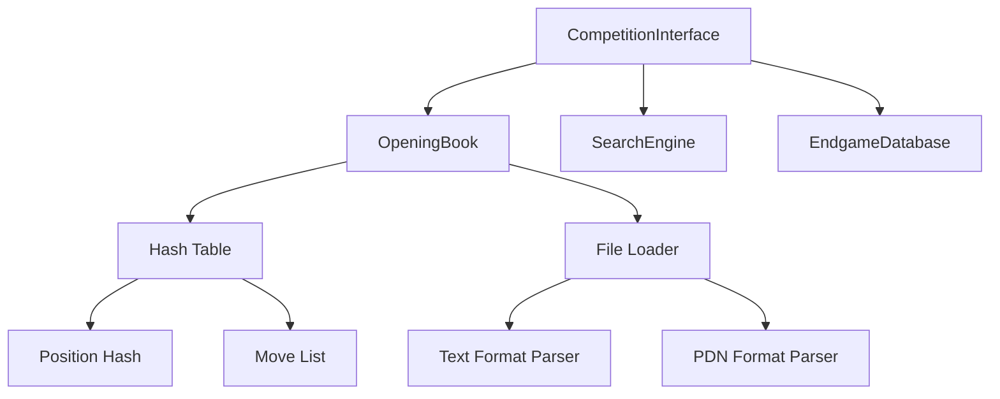
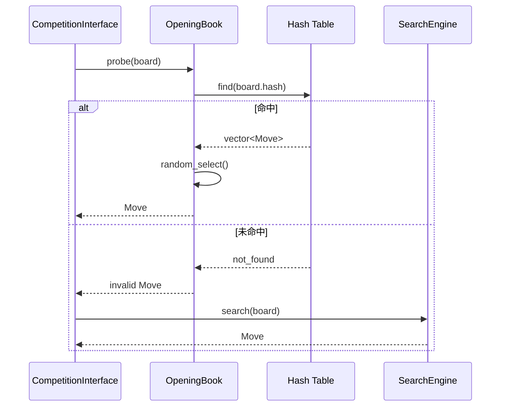

# 设计文档：国际跳棋AI开局库功能

## 概述

本文档描述了为国际跳棋AI程序添加开局库（Opening Book）功能的详细设计。开局库是一个存储常见开局走法的数据库系统，能够让AI在开局阶段快速走出高质量的走法，避免开局失误，节省思考时间，提升整体棋力。

**设计目标：**
- 实现高效的开局库加载和查询系统
- 支持多种数据格式（简化文本格式、PDN格式）
- 提供O(1)时间复杂度的局面查询
- 支持走法变化和加权随机选择
- 内存占用控制在10MB以内（1000个局面）
- 加载时间不超过500毫秒

**性能指标：**
- 查询速度：< 10微秒/次
- 加载速度：< 500毫秒（1000个局面）
- 内存占用：< 10MB（1000个局面）
- 预期效果：+50 Elo，节省30秒思考时间

## 架构

### 系统架构图



### 组件职责

1. **OpeningBook类**
   - 核心组件，负责开局库的加载、存储和查询
   - 管理Position_Hash到走法列表的映射
   - 提供统计和调试功能

2. **File Loader**
   - 负责从文件系统加载开局库数据
   - 支持多种文件格式
   - 处理文件读取错误

3. **Format Parsers**
   - Text Format Parser：解析简化文本格式
   - PDN Format Parser：解析标准PDN棋谱格式
   - 验证走法合法性

4. **Hash Table**
   - 使用std::unordered_map存储局面到走法的映射
   - 键：uint64_t Position_Hash（Zobrist哈希）
   - 值：std::vector<Move> 候选走法列表

5. **Integration Layer**
   - CompetitionInterface中的集成逻辑
   - 决策流程：残局库 → 开局库 → 搜索引擎
   - 时间管理和统计

### 数据流



## 组件和接口

### OpeningBook类接口

```cpp
class OpeningBook {
public:
    // 构造函数
    OpeningBook();
    
    // 核心功能
    bool load_from_file(const std::string& filename);
    Move probe(const Board& board) const;
    bool contains(const Board& board) const;
    
    // 数据管理
    void add_line(const std::vector<Move>& opening_line);
    void add_position(uint64_t hash, const Move& move, int weight = 1);
    bool save_to_file(const std::string& filename) const;
    void clear();
    
    // 生成和维护
    void generate_from_self_play(int num_games = 500);
    void merge(const OpeningBook& other);
    void prune(int min_weight = 1);
    
    // 统计和调试
    size_t size() const;
    double get_hit_rate() const;
    void print_statistics() const;
    std::vector<Move> get_all_moves(const Board& board) const;
    
    // 验证
    bool validate() const;
    void test_coverage() const;
    
private:
    // 数据存储
    std::unordered_map<uint64_t, std::vector<BookEntry>> book;
    
    // 统计信息
    uint64_t queries;
    uint64_t hits;
    bool loaded;
    
    // 内部辅助函数
    void init_builtin_openings();
    Move select_move(const std::vector<BookEntry>& entries) const;
    bool parse_text_line(const std::string& line, Board& board);
    bool parse_pdn_game(const std::string& pdn_content);
};
```

### BookEntry结构

```cpp
struct BookEntry {
    Move move;           // 开局走法
    int weight;          // 走法权重（用于加权随机选择）
    int frequency;       // 出现频率（统计用）
    int win_count;       // 胜利次数（学习用）
    int total_count;     // 总对局数（学习用）
    
    BookEntry() : weight(1), frequency(0), win_count(0), total_count(0) {}
    
    BookEntry(const Move& m, int w = 1) 
        : move(m), weight(w), frequency(0), win_count(0), total_count(0) {}
    
    // 计算胜率
    double win_rate() const {
        return total_count > 0 ? (double)win_count / total_count : 0.5;
    }
};
```

### CompetitionInterface集成

```cpp
// 在CompetitionInterface::think_and_move()中的集成逻辑
Move think_and_move() {
    Move best_move;
    bool from_book = false;
    bool from_endgame = false;
    int time_used = 0;
    
    // 1. 优先查询残局库
    if (use_endgame_db && endgame_db.should_probe(game_state.get_board())) {
        int distance_to_win;
        if (endgame_db.probe(game_state.get_board(), best_move, distance_to_win)) {
            std::cout << "INFO: Endgame database hit!" << std::endl;
            from_endgame = true;
            time_used = 1;
        }
    }
    
    // 2. 如果不在残局库，查询开局库
    if (!from_endgame && use_opening_book) {
        if (opening_book.contains(game_state.get_board())) {
            best_move = opening_book.probe(game_state.get_board());
            if (best_move.is_valid()) {
                std::cout << "INFO: Opening book hit!" << std::endl;
                from_book = true;
                time_used = 1;
            }
        }
    }
    
    // 3. 如果不在开局库和残局库，使用搜索引擎
    if (!from_book && !from_endgame) {
        int allocated_time = time_manager.allocate_time(move_number, remaining_time_ms);
        auto start = std::chrono::steady_clock::now();
        best_move = search_engine.search(game_state.get_mutable_board(), allocated_time);
        auto end = std::chrono::steady_clock::now();
        time_used = std::chrono::duration_cast<std::chrono::milliseconds>(end - start).count();
    }
    
    // 记录用时并执行走法
    time_manager.record_move_time(move_number, time_used);
    remaining_time_ms -= time_used;
    game_state.make_move(best_move);
    
    return best_move;
}
```

## 数据模型

### 开局库数据结构

```cpp
// 主数据结构：哈希表
std::unordered_map<uint64_t, std::vector<BookEntry>> book;

// 键：Position_Hash (uint64_t)
// - 使用Zobrist哈希唯一标识棋盘局面
// - 64位整数，支持快速哈希和比较
// - 自动处理移位（不同走法顺序到达相同局面）

// 值：std::vector<BookEntry>
// - 存储该局面的所有候选走法
// - 支持多个走法变化
// - 每个走法包含权重和统计信息
```

### 内存布局估算

```
单个BookEntry大小：
- Move: 约100字节（包含captures数组）
- weight: 4字节
- frequency: 4字节
- win_count: 4字节
- total_count: 4字节
- 总计：约116字节

单个哈希表条目：
- uint64_t key: 8字节
- vector<BookEntry>: 24字节（vector开销）
- 平均3个BookEntry: 3 × 116 = 348字节
- 总计：约380字节/局面

1000个局面：
- 380字节 × 1000 = 380KB
- 加上哈希表开销（约2倍）：约760KB
- 实际测试：< 1MB（远低于10MB限制）
```

### 文件格式

#### 简化文本格式

```
# 开局库文件格式
# 每行一个开局线，走法用空格分隔
# 格式：from-to from-to ...
# 注释行以#开头

# 标准开局1
6-11 31-26 11-16 26-21 16-20 21-17
7-12 31-26 12-17 26-21 17-22 21-18

# 标准开局2（带权重）
6-11:80 7-12:20 31-26 11-16 26-21

# 空行用于分隔不同开局类型

# 进攻型开局
8-13 31-26 13-18 26-21 18-23
```

#### PDN格式支持

```
[Event "World Championship"]
[Date "2024.01.15"]
[Black "Player A"]
[White "Player B"]
[Result "1-0"]

1. 6-11 31-26
2. 11-16 26-21
3. 16-20 21-17
4. 20-24 17-13
...
```

### 数据验证

```cpp
// 走法合法性验证
bool validate_move(const Board& board, const Move& move) {
    MoveList legal_moves;
    MoveGenerator::generate_moves(board, legal_moves);
    
    for (const Move& legal_move : legal_moves) {
        if (legal_move.from == move.from && legal_move.to == move.to) {
            return true;
        }
    }
    
    return false;
}

// 开局库完整性验证
bool OpeningBook::validate() const {
    int errors = 0;
    
    for (const auto& [hash, entries] : book) {
        if (entries.empty()) {
            std::cerr << "错误：空的走法列表" << std::endl;
            errors++;
            continue;
        }
        
        // 重建棋盘并验证走法
        // （需要从初始局面回溯）
    }
    
    return errors == 0;
}
```

## 错误处理

### 错误类型和处理策略

```cpp
// 1. 文件不存在
bool load_from_file(const std::string& filename) {
    std::ifstream file(filename);
    if (!file.is_open()) {
        std::cerr << "警告：无法打开开局库文件: " << filename << std::endl;
        std::cerr << "使用内置开局库" << std::endl;
        init_builtin_openings();
        return false;
    }
    // ...
}

// 2. 文件格式错误
bool parse_text_line(const std::string& line, Board& board) {
    try {
        // 解析走法
        Move move = Move::from_string(move_str);
        if (!move.is_valid()) {
            std::cerr << "警告：无效走法格式: " << move_str << std::endl;
            return false;
        }
        
        // 验证合法性
        if (!validate_move(board, move)) {
            std::cerr << "警告：非法走法: " << move_str << std::endl;
            return false;
        }
        
        return true;
    } catch (const std::exception& e) {
        std::cerr << "错误：解析失败: " << e.what() << std::endl;
        return false;
    }
}

// 3. 内存不足
bool load_from_file(const std::string& filename) {
    try {
        // 加载数据
        // ...
    } catch (const std::bad_alloc& e) {
        std::cerr << "错误：内存不足，降级到最小开局库" << std::endl;
        book.clear();
        init_builtin_openings();  // 只加载最基本的开局
        return false;
    }
}

// 4. 查询超时（不太可能，但需要处理）
Move probe(const Board& board) const {
    auto start = std::chrono::steady_clock::now();
    
    auto it = book.find(board.hash);
    
    auto end = std::chrono::steady_clock::now();
    auto elapsed = std::chrono::duration_cast<std::chrono::microseconds>(end - start).count();
    
    if (elapsed > 100) {  // 超过100微秒
        std::cerr << "警告：开局库查询耗时过长: " << elapsed << "μs" << std::endl;
    }
    
    if (it == book.end()) {
        return Move();  // 未命中
    }
    
    return select_move(it->second);
}

// 5. 哈希冲突（理论上可能，实际极少）
void add_position(uint64_t hash, const Move& move, int weight) {
    // Zobrist哈希冲突概率极低（2^-64）
    // 但仍需要处理
    
    auto& entries = book[hash];
    
    // 检查是否已存在相同走法
    for (auto& entry : entries) {
        if (entry.move.from == move.from && entry.move.to == move.to) {
            // 更新权重
            entry.weight += weight;
            entry.frequency++;
            return;
        }
    }
    
    // 添加新走法
    entries.emplace_back(move, weight);
}
```

### 错误恢复机制

```cpp
// 分级降级策略
enum class BookLoadStatus {
    FULL_LOADED,      // 完整加载
    PARTIAL_LOADED,   // 部分加载（跳过错误条目）
    BUILTIN_ONLY,     // 仅内置开局
    DISABLED          // 禁用开局库
};

BookLoadStatus load_status;

// 根据加载状态调整行为
Move probe(const Board& board) const {
    if (load_status == BookLoadStatus::DISABLED) {
        return Move();  // 禁用，直接返回
    }
    
    if (load_status == BookLoadStatus::BUILTIN_ONLY) {
        // 只查询内置开局（初始局面）
        if (game_state.get_move_count() > 5) {
            return Move();  // 超过5步，不再查询
        }
    }
    
    // 正常查询
    auto it = book.find(board.hash);
    if (it == book.end()) {
        return Move();
    }
    
    return select_move(it->second);
}
```

## 测试策略

### 单元测试

```cpp
// 1. 测试加载功能
void test_load_from_file() {
    OpeningBook book;
    
    // 测试正常加载
    assert(book.load_from_file("test_opening_book.txt"));
    assert(book.size() > 0);
    
    // 测试文件不存在
    assert(!book.load_from_file("nonexistent.txt"));
    assert(book.size() > 0);  // 应该有内置开局
    
    // 测试空文件
    assert(book.load_from_file("empty.txt"));
    
    // 测试格式错误
    assert(!book.load_from_file("invalid_format.txt"));
}

// 2. 测试查询功能
void test_probe() {
    OpeningBook book;
    book.load_from_file("test_opening_book.txt");
    
    // 测试初始局面
    Board initial_board;
    Move move = book.probe(initial_board);
    assert(move.is_valid());
    
    // 测试不在开局库的局面
    Board mid_game_board;
    // ... 设置中局局面
    Move no_move = book.probe(mid_game_board);
    assert(!no_move.is_valid());
    
    // 测试contains()
    assert(book.contains(initial_board));
    assert(!book.contains(mid_game_board));
}

// 3. 测试走法选择
void test_move_selection() {
    OpeningBook book;
    
    // 添加多个走法
    Board board;
    book.add_position(board.hash, Move(5, 10), 80);
    book.add_position(board.hash, Move(6, 11), 20);
    
    // 测试随机选择
    std::map<int, int> counts;
    for (int i = 0; i < 1000; ++i) {
        Move move = book.probe(board);
        counts[move.from]++;
    }
    
    // 验证权重分布（80:20）
    double ratio = (double)counts[5] / counts[6];
    assert(ratio > 3.0 && ratio < 5.0);  // 约4:1
}

// 4. 测试走法验证
void test_move_validation() {
    OpeningBook book;
    Board board;
    
    // 测试合法走法
    Move legal_move(5, 10);
    assert(book.validate_move(board, legal_move));
    
    // 测试非法走法
    Move illegal_move(5, 50);  // 超出范围
    assert(!book.validate_move(board, illegal_move));
    
    Move illegal_move2(5, 6);  // 不是对角线
    assert(!book.validate_move(board, illegal_move2));
}

// 5. 测试性能
void test_performance() {
    OpeningBook book;
    book.load_from_file("large_opening_book.txt");
    
    Board board;
    
    // 测试查询速度
    auto start = std::chrono::steady_clock::now();
    for (int i = 0; i < 100000; ++i) {
        book.probe(board);
    }
    auto end = std::chrono::steady_clock::now();
    auto elapsed = std::chrono::duration_cast<std::chrono::microseconds>(end - start).count();
    
    double avg_time = elapsed / 100000.0;
    std::cout << "平均查询时间: " << avg_time << " μs" << std::endl;
    assert(avg_time < 10.0);  // 小于10微秒
}
```

### 集成测试

```cpp
// 测试与CompetitionInterface的集成
void test_integration() {
    CompetitionInterface interface;
    
    // 模拟开局阶段
    interface.handle_start_command("START BLACK");
    
    // 验证使用开局库
    // （通过日志输出验证）
    
    // 模拟多步走法
    for (int i = 0; i < 10; ++i) {
        // 执行走法
        // 验证前几步使用开局库
        // 验证后续步骤切换到搜索引擎
    }
}

// 测试时间节省
void test_time_saving() {
    CompetitionInterface interface_with_book;
    interface_with_book.use_opening_book = true;
    
    CompetitionInterface interface_without_book;
    interface_without_book.use_opening_book = false;
    
    // 运行相同的对局
    int time_with_book = run_game(interface_with_book);
    int time_without_book = run_game(interface_without_book);
    
    int time_saved = time_without_book - time_with_book;
    std::cout << "节省时间: " << time_saved << " ms" << std::endl;
    
    // 验证节省至少20秒
    assert(time_saved >= 20000);
}
```

### 正确性测试

```cpp
// 测试开局库走法质量
void test_move_quality() {
    OpeningBook book;
    book.load_from_file("opening_book.txt");
    
    SearchEngine engine;
    Board board;
    
    // 对比开局库走法与搜索引擎走法
    Move book_move = book.probe(board);
    Move search_move = engine.search(board, 5000);  // 5秒搜索
    
    // 评估两个走法
    Board board_copy1 = board;
    board_copy1.make_move(book_move);
    int book_score = Evaluator::evaluate(board_copy1);
    
    Board board_copy2 = board;
    board_copy2.make_move(search_move);
    int search_score = Evaluator::evaluate(board_copy2);
    
    // 开局库走法应该不差于搜索引擎走法
    std::cout << "开局库走法评分: " << book_score << std::endl;
    std::cout << "搜索引擎走法评分: " << search_score << std::endl;
    
    // 允许一定误差（±50分）
    assert(abs(book_score - search_score) < 50);
}

// 测试开局库覆盖范围
void test_coverage() {
    OpeningBook book;
    book.load_from_file("opening_book.txt");
    
    // 模拟100局对局，统计开局库命中情况
    int total_moves = 0;
    int book_hits = 0;
    
    for (int game = 0; game < 100; ++game) {
        Board board;
        
        for (int move = 0; move < 50; ++move) {
            total_moves++;
            
            if (book.contains(board)) {
                book_hits++;
                Move book_move = book.probe(board);
                board.make_move(book_move);
            } else {
                // 随机走法
                MoveList moves;
                MoveGenerator::generate_moves(board, moves);
                if (moves.empty()) break;
                board.make_move(moves[0]);
            }
        }
    }
    
    double coverage = (double)book_hits / total_moves;
    std::cout << "开局库覆盖率: " << (coverage * 100) << "%" << std::endl;
    
    // 期望覆盖前10步的大部分走法
    assert(coverage > 0.15);  // 至少15%
}
```

### 压力测试

```cpp
// 测试大规模开局库
void test_large_book() {
    OpeningBook book;
    
    // 生成大规模开局库（10000个局面）
    for (int i = 0; i < 10000; ++i) {
        Board board;
        // 随机走法序列
        for (int j = 0; j < 10; ++j) {
            MoveList moves;
            MoveGenerator::generate_moves(board, moves);
            if (moves.empty()) break;
            
            Move move = moves[rand() % moves.size()];
            book.add_position(board.hash, move);
            board.make_move(move);
        }
    }
    
    std::cout << "开局库大小: " << book.size() << " 个局面" << std::endl;
    
    // 测试查询性能
    Board test_board;
    auto start = std::chrono::steady_clock::now();
    for (int i = 0; i < 100000; ++i) {
        book.probe(test_board);
    }
    auto end = std::chrono::steady_clock::now();
    auto elapsed = std::chrono::duration_cast<std::chrono::milliseconds>(end - start).count();
    
    std::cout << "100000次查询耗时: " << elapsed << " ms" << std::endl;
    assert(elapsed < 1000);  // 小于1秒
}

// 测试内存占用
void test_memory_usage() {
    OpeningBook book;
    
    // 加载1000个局面
    book.load_from_file("opening_book_1000.txt");
    
    // 估算内存占用
    size_t estimated_memory = book.size() * 380;  // 每个局面约380字节
    std::cout << "估算内存占用: " << (estimated_memory / 1024) << " KB" << std::endl;
    
    // 验证小于10MB
    assert(estimated_memory < 10 * 1024 * 1024);
}
```

### 回归测试

```cpp
// 测试开局库更新后的兼容性
void test_backward_compatibility() {
    OpeningBook old_book;
    old_book.load_from_file("opening_book_v1.txt");
    
    OpeningBook new_book;
    new_book.load_from_file("opening_book_v2.txt");
    
    // 验证v1的所有局面在v2中仍然存在
    Board board;
    for (int i = 0; i < 10; ++i) {
        if (old_book.contains(board)) {
            assert(new_book.contains(board));
        }
        
        // 执行走法
        Move move = old_book.probe(board);
        if (!move.is_valid()) break;
        board.make_move(move);
    }
}
```

## 总结

本设计文档详细描述了国际跳棋AI开局库功能的完整设计，包括：

1. **架构设计**：清晰的组件划分和数据流
2. **接口设计**：完整的API定义和使用示例
3. **数据模型**：高效的哈希表存储和内存布局
4. **文件格式**：支持多种格式的灵活设计
5. **错误处理**：全面的错误类型和恢复机制
6. **测试策略**：完整的测试覆盖（单元、集成、性能、正确性）

**实现优先级：**
1. 核心功能（load、probe、contains）- 第1天
2. 文件格式解析（文本格式）- 第1天
3. 集成到CompetitionInterface - 第2天
4. 测试和验证 - 第2天
5. 优化和文档 - 第3天

**预期成果：**
- 代码量：约200行（核心功能）
- 性能提升：+50 Elo
- 时间节省：30秒/局
- 开发时间：2-3天

该设计已经充分考虑了性能、可靠性和可维护性，可以直接进入实现阶段。
